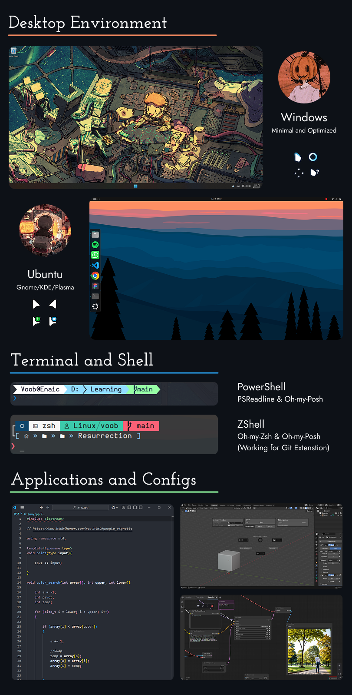

# Resurrection  &nbsp;  

**Resurrection** is an automation scripts written Primarily in **Bash Script** & **Python** that sets up my Applications,themes and configuration files on any operating system I use (**Windows** or **Linux**). It ensures my development and workspace environment is always configured exactly the way I like it, and I love breaking my Operating Systems so This comes in handy.

##  &nbsp; Features 



- **Automated Setup**   &emsp; – &emsp; Installs and configures themes, dotfiles, and essential tools.
- **Cross-Platform**    &emsp; &emsp; – &emsp; Works on **Windows** and **Linux**.
- **Fast & Efficient**  &emsp; &emsp; – &emsp; Installs the Patches and licenses automatically.
- **Customizable** &emsp;&emsp;&emsp; – &emsp; Easily extend or modify configurations for different setups.

##  &nbsp; Installation & Usage


### &emsp; ⭕ Linux (Debian-based)
```bash
chmod +x unload.sh
./unload.sh
```

### &emsp; ⭕ Windows (Using Python)
```powershell
python.exe ./Windows_Deploy/Deploy_Script.py

```

##  &nbsp; Contributions
This is my personal automation toolkit, but if you have suggestions or improvements, feel free to open an issue or PR! 


<p align="center"></p> 
